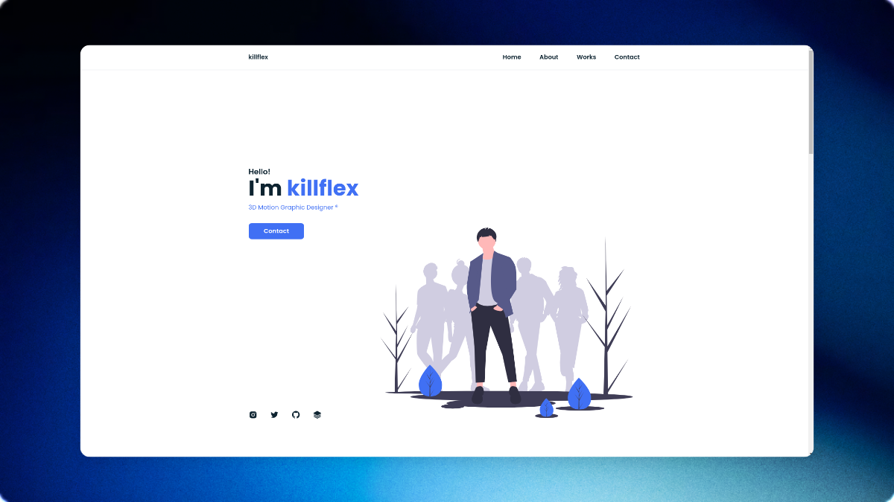

# killflex's Portfolio



## 🎨 About

A stunning personal portfolio website showcasing the work of **Ferry Hasan (killflex)**, a talented 3D Motion Graphic Designer and 3D Artist based in Surabaya, Indonesia. This portfolio features beautiful 3D artwork, illustrations, and motion graphics created with industry-standard tools.

## ✨ Features

- **Responsive Design** - Fully responsive layout that works seamlessly across all devices
- **Modern UI/UX** - Clean, professional interface with smooth animations
- **Interactive Gallery** - Lightbox integration for viewing artwork in detail
- **Contact Form** - Integrated contact form for job inquiries and collaborations
- **Social Media Integration** - Direct links to Instagram, Twitter, GitHub, and more
- **Smooth Scrolling** - Enhanced user experience with scroll reveal animations

## 🛠️ Technologies Used

- **HTML5** - Semantic markup structure
- **CSS3** - Custom styling with modern CSS features
- **JavaScript** - Interactive functionality and animations
- **Libraries & Frameworks:**
  - [Normalize.css](https://necolas.github.io/normalize.css/) - CSS reset
  - [Font Awesome](https://fontawesome.com/) - Icon library
  - [Boxicons](https://boxicons.com/) - Additional icon set
  - [Lightbox2](https://lokeshdhakar.com/projects/lightbox2/) - Image gallery
  - [ScrollReveal](https://scrollrevealjs.org/) - Scroll animations
  - [Bootstrap](https://getbootstrap.com/) - Grid system and utilities
  - [jQuery](https://jquery.com/) - DOM manipulation

## 📂 Project Structure

```
killflex.github.io/
├── assets/
│   ├── css/           # Stylesheets
│   ├── img/           # Images and visual assets
│   ├── js/            # JavaScript files
│   └── library/       # Third-party libraries
├── index.html         # Main portfolio page
├── success.html       # Form submission success page
├── web-preview.png    # Portfolio preview image
└── README.md          # Project documentation
```

## 🎯 Sections

1. **Home** - Eye-catching hero section with introduction
2. **About** - Personal background and professional journey
3. **Works** - Portfolio gallery featuring 3D art and illustrations
4. **Contact** - Contact form for inquiries and collaborations

## 🚀 Getting Started

### Prerequisites

- A modern web browser (Chrome, Firefox, Safari, Edge)
- Basic understanding of HTML/CSS/JS (for customization)

### Installation

1. Clone the repository:
```bash
git clone https://github.com/killflex/killflex.github.io.git
```

2. Navigate to the project directory:
```bash
cd killflex.github.io
```

3. Open `index.html` in your browser or use a local development server:
```bash
# Using Python 3
python -m http.server 8000

# Using Node.js (with http-server)
npx http-server
```

4. Visit `http://localhost:8000` in your browser